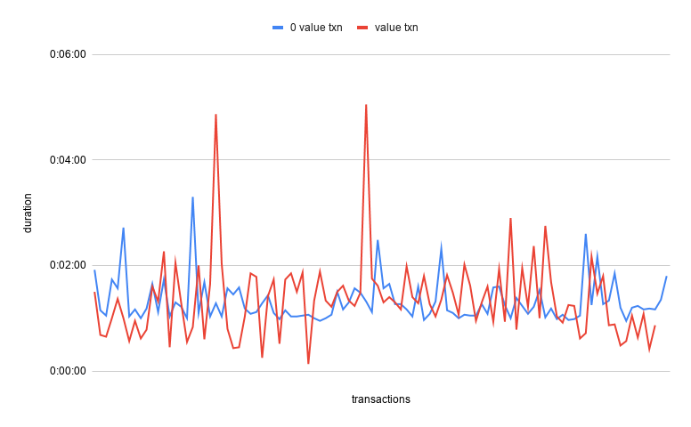

# Calculate IOTA confirm duration

Send 100 IOTA transactions and measure the confirm duration.

## Environment
- IRI version: 1.8.2
- Test date: Wed Nov 13 23:25:56 CST 2019 
- TPS: 6.62
- CTPS: 6.88

## Usage
- Set `SEED` and `RECEIVE_ADDR` value in config_iota_wallet.py
- `$ python3 test.py` 

## Output

